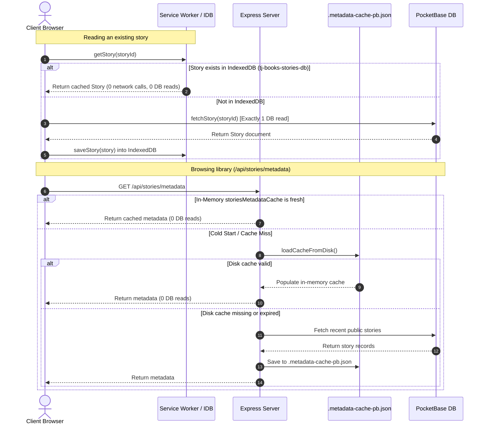
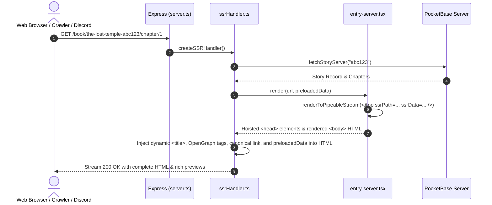
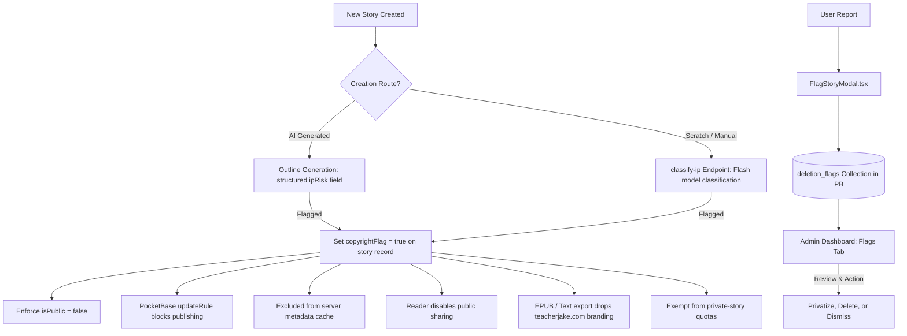
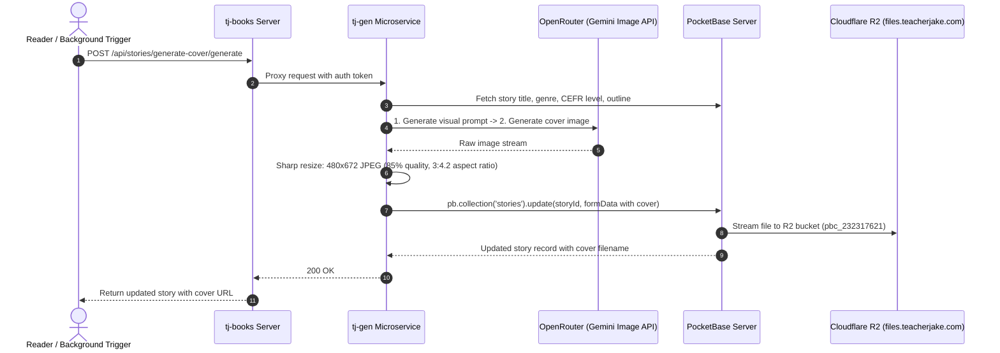

# System Architecture: `tj-books` (CEFR Graded Books Generator)

This document details the high-level architecture, client-server boundaries, routing structure, provider-neutral design patterns, Server-Side Rendering (SSR) & SEO pipeline, offline-first caching system, microservice proxy boundary, and core learning systems of **`tj-books`** (deployed at [`books.teacherjake.com`](https://books.teacherjake.com)), part of the `teacherjake.com` ecosystem.

---

## 1. High-Level Architecture & Service Topology

The application operates as a full-stack Node.js / Express application hosting a React 19 client with hybrid Server-Side Rendering (SSR), an offline-first PWA caching layer, abstracted authentication and database services, and a dedicated proxy boundary delegating heavy AI generation workloads to the `tj-gen` microservice.

```mermaid
graph TD
    subgraph Client Browser [Client Browser - books.teacherjake.com]
        App([App.tsx]) --> Browse[BrowsePage.tsx]
        App --> Bookshelf[BookshelfPage.tsx]
        App --> Create[CreatePage.tsx]
        App --> Reader[ReaderPage.tsx]
        App --> Notes[NotesPage.tsx]
        App --> Practice[PracticePage.tsx]
        App --> Admin[AdminPage.tsx / AdminUsersDashboard]
        App --> About[AboutPage.tsx]
        
        App --> Stores[Zustand Stores: authStore & uiStore]
        App --> Hooks[Custom Hooks: useActiveStory, useStoryGeneration, useStreak, useExport...]
        App --> SW[PWA Service Worker: Workbox Caches]
        App --> IDB[(IndexedDB: tj-books-stories-db via idb-keyval)]
        App --> IAuth[IAuthService]
        App --> IDBService[IDatabaseService]
    end
    
    subgraph Express Server [Express Application Server - server.ts]
        Server[server.ts] --> SSR[SSR Handler: ssrHandler.ts & entry-server.tsx]
        Server --> APIRouter[API Router: src/server/routes/api.ts]
        Server --> StaticCovers[Static Covers: /covers/*]
        
        APIRouter --> LocalMeta[/api/stories/metadata]
        APIRouter --> LocalUserSync[/api/users/sync]
        APIRouter --> RateLimiter[Rate Limiters: generationLimiter, translationLimiter]
        APIRouter --> Proxy[Proxy to tj-gen: proxyToTJGen]
        
        LocalMeta <--> MetadataCache[In-Memory storiesMetadataCache]
        MetadataCache <--> DiskBackupCache[(.metadata-cache-pb.json)]
    end
    
    subgraph Backend & External Services
        direction TB
        subgraph PocketBase [PocketBase DB & Auth - pb.teacherjake.com]
            PB_DB[(Collections: stories, users, story_highlights, story_completions, deletion_flags)]
        end
        
        subgraph Cloudflare CDN & Storage [Cloudflare R2 - files.teacherjake.com]
            R2[(Story Cover Images Bucket)]
        end
        
        subgraph Microservice [tj-gen Microservice - gen.teacherjake.com]
            TJGen[OpenRouter LLM Pipelines, Sharp Image Resizing, TTS & IP Classifier]
        end
    end

    IAuth -.-> PocketBase
    IDBService -.-> PocketBase
    LocalMeta --> PocketBase
    LocalUserSync --> PocketBase
    SSR --> PocketBase
    Proxy --> TJGen
    TJGen --> PocketBase
    TJGen --> R2
    Client Browser -->|Read Cover CDN| R2
```

---

## 2. Abstracted Service Layer Architecture

To prevent tight coupling to vendor-specific SDKs, the frontend client delegates all database and authentication operations to abstract interfaces. PocketBase is the default backend, but the architecture allows swapping or extending providers by implementing the defined contracts.

### A. Authentication Abstraction (`IAuthService`)
The authentication layer is defined by the [IAuthService](file:///home/jmayer/Dev/teacherjake.com/tj-books/src/services/auth/AuthService.ts) interface.
* **Active Implementation**:
  * [PocketBaseAuthService](file:///home/jmayer/Dev/teacherjake.com/tj-books/src/services/auth/PocketBaseAuthService.ts): Interacts with PocketBase client SDK for email/password authentication, user profile management, session validation, and JWT token management.
* **Provider Switch**: To switch providers, implement `IAuthService` and re-export the instance in [src/services/auth/index.ts](file:///home/jmayer/Dev/teacherjake.com/tj-books/src/services/auth/index.ts).

### B. Database Abstraction (`IDatabaseService`)
All core database operations (story metadata queries, full story CRUD, bookshelf updates, dictionary lookups, user streaks, reading activity, highlights, and deletion flags) are defined by the [IDatabaseService](file:///home/jmayer/Dev/teacherjake.com/tj-books/src/services/db/DatabaseService.ts) interface.
* **Active Implementation**:
  * [PocketBaseService](file:///home/jmayer/Dev/teacherjake.com/tj-books/src/services/db/PocketBaseService.ts): Connects to PocketBase, handles JSON serialization/deserialization of story chapters and metadata, and performs typed collection operations across `stories`, `users`, `story_highlights`, `story_completions`, and `deletion_flags`.
* **Provider Switch**: Implement `IDatabaseService` and update the export in [src/services/db/index.ts](file:///home/jmayer/Dev/teacherjake.com/tj-books/src/services/db/index.ts).

### C. Story Persistence Orchestrator (`storyPersistence.ts`)
The [src/services/storyPersistence.ts](file:///home/jmayer/Dev/teacherjake.com/tj-books/src/services/storyPersistence.ts) module serves as a coordinator between:
1. Writing story records and updates to PocketBase via `IDatabaseService`.
2. Saving or updating the offline copy in IndexedDB (`saveStory`).
3. Calling `/api/stories/metadata?refresh=true&storyId=...` to revalidate the server metadata cache in $O(1)$ time.
4. Triggering asynchronous cover art generation via `/api/stories/generate-cover/generate`.

---

## 3. Caching, Offline Storage & Read Optimization

To provide near-instant page loads, zero-read repeat visits, and resilience against offline network dropouts, the system utilizes a multi-tiered caching architecture across IndexedDB, Service Worker (Workbox), server memory, and filesystem disk caches.



### A. Client-Side Browser Storage & IndexedDB (`offlineStorage.ts`)
* **IndexedDB Store (`idb-keyval`)**: All full story documents are stored in IndexedDB under the database `tj-books-stories-db` (object store `stories`). Metadata and guest completed IDs are stored in `tj-books-meta-db` (object store `meta`).
* **Synchronous In-Memory Map**: An in-memory `Map<string, Story>` (`memoryStoryCache`) mirrors IndexedDB reads to eliminate microtask latency on repeated component renders.
* **Persistent Storage API**: Requests `navigator.storage.persist()` on supported browsers to prevent storage eviction under low-disk pressure.
* **One-Time LocalStorage Migration (`migrateFromLocalStorage`)**: Automatically detects legacy `cefr_story_cache_*`, `completed_story_*`, and `cefr_cached_story_ids` keys in `localStorage`, transfers them into IndexedDB, and deletes the old keys to prevent exceeding the browser's 5MB `localStorage` quota.

### B. Service Worker Caching (`vite-plugin-pwa` & Workbox)
Configured in [vite.config.ts](file:///home/jmayer/Dev/teacherjake.com/tj-books/vite.config.ts):
1. **Precached App Shell**: Core JavaScript, CSS, HTML, and static SVGs/icons are precached via Workbox glob patterns.
2. **Google & GStatic Fonts Cache**: `CacheFirst` strategy with 1-year expiration.
3. **Stories Metadata (`/api/stories/metadata`)**: `NetworkFirst` strategy with a 3-second network timeout fallback to cache.
4. **Cover Images (`/covers/*`, `files.teacherjake.com`)**: `StaleWhileRevalidate` strategy (up to 100 entries, 30 days retention).

### C. Server-Side Metadata Caching (`pocketbase.ts` & `database.ts`)
The Express server maintains an in-memory array (`storiesMetadataCache`) representing public stories.
* **File-Based Backup Cache (`.metadata-cache-pb.json`)**: On server boot, [loadCacheFromDiskSync](file:///home/jmayer/Dev/teacherjake.com/tj-books/src/server/lib/database.ts) synchronously loads `.metadata-cache-pb.json`, preventing high read spikes against PocketBase on cold starts or dev server reloads.
* **Incremental Updates ($O(1)$ Complexity)**: When stories are published, edited, or deleted, client mutations ping `/api/stories/metadata?refresh=true`:
  * `?storyId=[id]`: Fetches only that single story document from PocketBase (1 read), computes word count and reading stats, and updates the in-memory cache and disk backup.
  * `?deleteId=[id]`: Removes the story from cache in memory and on disk with **0 reads**.
* **Admin Full Refresh Override**: Admins can trigger `/api/stories/metadata?refresh=true&forceAll=true` to rebuild the entire metadata cache from PocketBase.
* **Server Story Document Cache**: [fetchStoryServer](file:///home/jmayer/Dev/teacherjake.com/tj-books/src/server/lib/pocketbase.ts) maintains an in-memory Map of recently fetched full story documents for SSR with automatic invalidation on updates.

---

## 4. Server-Side Rendering (SSR) & Dynamic SEO System

To ensure fast First Contentful Paint (FCP) and rich social media previews (OpenGraph and Twitter cards), `tj-books` uses a hybrid SSR architecture powered by React 19's streaming API.



### A. Server Handler (`src/server/lib/ssrHandler.ts`)
* Intercepts all page requests (excluding static assets and `/api/*` endpoints).
* For `/book/:slug` and `/book/:slug/chapter/:chapterNum` URLs:
  * Resolves the story ID using `getStoryIdFromSegment`.
  * Preloads story data via `fetchStoryServer` and metadata via `getStoriesMetadataSync`.
  * Computes dynamic titles (e.g. `Title | Ch 1: Intro - Graded Spanish Reader (CEFR B1)`).
  * Injects canonical link tags, OpenGraph cards (`og:title`, `og:description`, `og:image`), Twitter cards (`summary_large_image`), and JSON-LD structured metadata.
  * Injects `window.__INITIAL_DATA__ = { stories: [...], story: {...} }` so the React client hydrates instantly without initial fetch flickers.

### B. React 19 Streaming SSR (`src/entry-server.tsx`)
* Uses `renderToPipeableStream` from `react-dom/server`.
* Automatically extracts resource tags (`<link>`, `<style>`, `<meta>`) hoisted by React 19 to inject them into the HTML document `<head>`.
* Includes a 5-second abort fallback to prevent hanging requests.

### C. Dual Build Pipeline (`package.json`)
The production build compiles three artifacts:
1. Client bundle: `vite build --outDir dist/client`
2. SSR server bundle: `vite build --ssr src/entry-server.tsx --outDir dist/server`
3. Node server bundle: `esbuild server.ts --bundle --platform=node --format=cjs --packages=external --sourcemap --outfile=dist/server.cjs`

---

## 5. AI Generation & Microservice Proxy Boundary (`tj-gen`)

Heavy AI generation pipelines (outline generation, chapter streaming, batch generation, vocabulary glossary generation, cover art creation, and server-side text-to-speech) are delegated from `tj-books` to the dedicated **`tj-gen`** microservice ([gen.teacherjake.com](https://gen.teacherjake.com)).

### A. Proxy Handler (`src/server/lib/proxy.ts`)
The `proxyToTJGen` reverse proxy handler forwards requests from `tj-books` to `tj-gen`:
* Forwards authorization headers (`Bearer ${token}` from PocketBase), custom OpenRouter keys (`X-OpenRouter-API-Key`), and internal service keys (`X-Service-Key`).
* Streams chunked responses directly back to the client browser for real-time chapter generation.

### B. Rate Limiting Policy
Configured via `express-rate-limit` in [src/server/lib/proxy.ts](file:///home/jmayer/Dev/teacherjake.com/tj-books/src/server/lib/proxy.ts):
* **Metadata Limiter (`metadataLimiter`)**: 100 requests per 5 minutes per IP.
* **Generation Limiter (`generationLimiter`)**: 30 requests per 10 minutes per IP (protects costly LLM endpoints).
* **Translation Limiter (`translationLimiter`)**: 120 requests per minute per IP (accommodates active reading lookups).

### C. Proxied Endpoints
| Route | Destination in `tj-gen` | Purpose |
|---|---|---|
| `/api/stories/generate-outline` | `tj-gen/src/routes/outline.ts` | Generates story outline, character profiles, story bible, and zero-cost IP risk classification |
| `/api/stories/generate-chapter` | `tj-gen/src/routes/chapter.ts` | Generates or regenerates single chapters using OpenRouter models |
| `/api/stories/generate-batch` | `tj-gen/src/routes/batch-chapter.ts` | Background batch generation of multiple chapters |
| `/api/stories/generate-glossary` | `tj-gen/src/routes/glossary.ts` | Extracts vocabulary definitions, CEFR ratings, and context sentences |
| `/api/stories/generate-cover` | `tj-gen/src/routes/cover.ts` | Concept prompt generation, OpenRouter image call, Sharp resizing, R2 upload |
| `/api/stories/maintenance` | `tj-gen/src/routes/maintenance.ts` | Story bible updates, consistency audits, tone refreshes, and surgical multi-chapter consistency edits (`/propose-consistency-edits`) |
| `/api/stories/classify-ip` | `tj-gen/src/routes/classify.ts` | Lightweight IP classifier for manually created/scratch outlines |
| `/api/translate` | `tj-gen/src/routes/translate.ts` | Inline sentence/phrase translations during reading |

---

## 6. Copyright Guard & Content Moderation System

To ensure compliance with intellectual property standards while allowing personal fan fiction for private study, `tj-books` implements a multi-layered copyright guard and content moderation system.



### A. Database Fields (`stories` collection)
* `copyrightFlag` (bool) — master flag forcing the story to be private.
* `copyrightFlagReason` (text) — short explanation (e.g. `"Harry Potter fan fiction"`).
* `copyrightFlagSource` (select) — `'ai'`, `'admin'`, `'backfill'`, or `'user'`.
* `copyrightFlaggedAt` (date) — audit timestamp.

### B. Multi-Layer Enforcement
1. **PocketBase API Rules**: Database `updateRule` prevents non-admins from setting `isPublic = true` when `copyrightFlag = true`.
2. **Metadata Cache Shield**: `getStoriesMetadata` strictly filters out any records with `copyrightFlag === true`.
3. **Client UI Shield**: Story cards display a "Restricted" badge; public share buttons are hidden; private story quotas count only elective private stories, exempting flagged stories.
4. **De-branded Exports**: Exporting an unlisted or flagged story removes `books.teacherjake.com` intro paragraphs, header tags, and branded metadata from EPUB, rich text, and clipboard exports.
5. **Community Reporting (`deletion_flags`)**: Users can report stories via [FlagStoryModal.tsx](file:///home/jmayer/Dev/teacherjake.com/tj-books/src/components/library/FlagStoryModal.tsx). Admins manage flagged reports and copyright reviews directly in the **Flags** and **Copyright Guard** tabs of [AdminUsersDashboard.tsx](file:///home/jmayer/Dev/teacherjake.com/tj-books/src/components/AdminUsersDashboard.tsx).

---

## 7. Guide: Adding or Removing LLM Models

All model configurations, pricing structures, and reasoning controls are centralized across a small set of well-defined files. Follow this checklist when adding or removing models:

### Checklist for Adding a Model

1. **Define the Model Option in [src/constants/models.ts](file:///home/jmayer/Dev/teacherjake.com/tj-books/src/constants/models.ts)**
   * Add a new `AIModelOption` object to the `AI_MODELS` array:
     ```typescript
     {
       id: 'provider/model-id', // Exact OpenRouter model identifier
       name: 'Model Display Name',
       inputCost1M: 0.15,       // OpenRouter input cost per 1M tokens ($)
       outputCost1M: 0.60,      // OpenRouter output cost per 1M tokens ($)
       category: 'flash',       // 'flash' | 'pro' | 'thinking'
       supportsThinkingLevel: true,
       supportsThinkingBudget: false,
       supportsTemperature: true,
       maxOutputTokens: 16384,
       requiresAgeVerification: false, // Set true if contributor endpoint / age-gated
     }
     ```
   * If the model is free for users without an API key, add its ID to `FREE_MODEL_IDS`.
   * If it represents a frontier/pro tier option, add it to `FRONTIER_LATEST_MODELS`.

2. **Add Model Details & Recommendations in [src/components/creator/ModelSelectionModal.tsx](file:///home/jmayer/Dev/teacherjake.com/tj-books/src/components/creator/ModelSelectionModal.tsx)**
   * Add an entry to the `MODEL_DETAILS` dictionary with `verdict` and `languages`:
     ```typescript
     'provider/model-id': {
       verdict: 'Clear summary of speed, strengths, and narrative quality.',
       languages: 'All supported languages (or specific optimal languages)',
     },
     ```

3. **Configure Reasoning & Provider Helpers in [src/utils/modelUtils.ts](file:///home/jmayer/Dev/teacherjake.com/tj-books/src/utils/modelUtils.ts)**
   * **`getModelBaseName`**: If the provider is not yet recognized (e.g. `'Anthropic'`, `'Cohere'`), add a matching rule.
   * **`getModelThinkingSupport`**: Define reasoning behavior (`'none'`, `'simple'`, `'level'`, or `'budget'`) and default budgets if non-standard.

4. **Verify Generation Microservice Support**
   * If the model requires custom prompt formatting or special parameter structures, check `tj-gen/src/routes/chapter.ts` and `tj-gen/src/routes/outline.ts`.

### Checklist for Removing a Model

1. **Remove Definitions**: Delete the entry from `AI_MODELS`, `FREE_MODEL_IDS`, and `FRONTIER_LATEST_MODELS` in [src/constants/models.ts](file:///home/jmayer/Dev/teacherjake.com/tj-books/src/constants/models.ts).
2. **Remove UI Details**: Delete its entry from `MODEL_DETAILS` in [src/components/creator/ModelSelectionModal.tsx](file:///home/jmayer/Dev/teacherjake.com/tj-books/src/components/creator/ModelSelectionModal.tsx).
3. **Verify Defaults and Fallbacks**: Ensure the removed model is not referenced as a fallback in:
   * [src/store/uiStore.ts](file:///home/jmayer/Dev/teacherjake.com/tj-books/src/store/uiStore.ts) (`defaultStoryModel`)
   * [src/utils/storyEstimation.ts](file:///home/jmayer/Dev/teacherjake.com/tj-books/src/utils/storyEstimation.ts)
   * `tj-gen/src/routes/chapter.ts`

---

## 8. Book Cover Image Generation System

The application automatically creates stylized visual book covers for generated stories using OpenRouter image models, Sharp image processing, and Cloudflare R2 storage.



* **Cloudflare R2 CDN Path**: `https://files.teacherjake.com/${collectionId}/${storyId}/${coverFilename}?t=${updated}` (where `collectionId` is `pbc_232317621`).
* **Cache Invalidation**: The client utility [getStoryCoverUrl](file:///home/jmayer/Dev/teacherjake.com/tj-books/src/utils/coverUtils.ts) automatically appends `?t=${story.updated}` to bust browser and CDN caches whenever a cover is regenerated.

---

## 9. Core Learning & Reader Feature Architecture

`tj-books` is more than a story generator; it is a full language-learning platform with integrated pedagogical tooling.

### A. Interactive Bilingual Reader ([ReaderPage.tsx](file:///home/jmayer/Dev/teacherjake.com/tj-books/src/pages/ReaderPage.tsx))
* **Tokenized Sentence & Word Segmentation**: Uses [segmentText](file:///home/jmayer/Dev/teacherjake.com/tj-books/src/utils/segmenter.ts) to segment text into clickable vocabulary units. Clicking any word performs instant lookup and context definition.
* **Inline Translation**: Allows readers to select sentences or phrases and request instant translations into their configured `translationTargetLanguage` via `/api/translate`.
* **Web Speech API Speech Synthesis**: Controlled by [useSpeechSynthesis.ts](file:///home/jmayer/Dev/teacherjake.com/tj-books/src/hooks/useSpeechSynthesis.ts), providing sentence-by-sentence text-to-speech with pitch, rate, and voice selection tailored to each language code.
* **Reader Typography Controls**: Stored in [uiStore.ts](file:///home/jmayer/Dev/teacherjake.com/tj-books/src/store/uiStore.ts) and synced to user profiles: font sizing, serif vs. sans-serif toggle, text alignment (`left` | `center` | `right` | `justify`), and column width (`narrow` | `medium` | `wide` | `full`).

### B. Highlights & Annotations ([NotesPage.tsx](file:///home/jmayer/Dev/teacherjake.com/tj-books/src/pages/NotesPage.tsx))
* **Multi-Color Highlighting**: Managed by [useStoryHighlights.ts](file:///home/jmayer/Dev/teacherjake.com/tj-books/src/hooks/useStoryHighlights.ts) supporting 5 color tags (`yellow`, `green`, `blue`, `purple`, `pink`).
* **Database Collection (`story_highlights`)**: Persists chapter index, paragraph index, character start/end offsets, selected text, color, and optional user notes.
* **Deep-Linking**: Clicking a note on `NotesPage` navigates the user directly to the exact story chapter and paragraph in `ReaderPage`.

### C. Spaced Repetition System (SRS) & Vocabulary Practice ([PracticePage.tsx](file:///home/jmayer/Dev/teacherjake.com/tj-books/src/pages/PracticePage.tsx))
* Words saved from reading are stored in the user's `savedVocab` deck.
* Implements an SM-2 spaced repetition algorithm tracking:
  * `repetition`: consecutive successful reviews.
  * `interval`: days until next review.
  * `easeFactor`: difficulty multiplier.
  * `nextReviewDate`: ISO date string.
* Includes flashcard practice modes and vocabulary matching games.

### D. Reading Streak & Activity Tracking ([useStreak.ts](file:///home/jmayer/Dev/teacherjake.com/tj-books/src/hooks/useStreak.ts))
* Tracks `currentStreak`, `maxStreak`, `lastActiveDate`, and `activityHistory` array.
* Logs activity upon completing chapters, practicing flashcards, or saving words.
* Automatically triggers celebratory modals on milestone streaks (3-day, 7-day, 30-day).

### E. E-Book Export Pipeline ([useExport.ts](file:///home/jmayer/Dev/teacherjake.com/tj-books/src/hooks/useExport.ts))
* **EPUB 3.0 Generation**: Client-side generation using `jszip` package:
  * Packages story chapters, cover images (downloaded and embedded as `cover.jpg`), table of contents (`toc.ncx` / `nav.xhtml`), content metadata (`content.opf`), and stylesheet (`styles.css`).
  * Embeds vocabulary glossaries as dedicated appendix chapters.
* **Clipboard & Rich Text**: Copies markdown or formatted HTML text with automatic header/attribution de-branding for unlisted stories.

---

## 10. Repository File Structure & Key Paths

```
tj-books/
├── ARCHITECTURE.md                 # System architecture (this document)
├── DEPLOYMENT.md                   # Systemd service & Nginx production setup
├── DESIGN.md                       # Design system & visual styling tokens
├── README.md                       # Quickstart & CLI commands
├── package.json                    # Scripts (build, dev, migrate, lint)
├── server.ts                       # Express server entry point (SSR, API router, static covers)
├── vite.config.ts                  # Vite + React + Tailwind v4 + VitePWA Workbox config
├── src/
│   ├── App.tsx                     # Main client router, active tabs, modal coordinators
│   ├── entry-server.tsx            # React 19 renderToPipeableStream SSR entry
│   ├── main.tsx                    # Client entry point (hydration & PWA registration)
│   ├── types.ts                    # Global TypeScript interfaces & CEFR/Language constants
│   ├── components/                 # UI components
│   │   ├── AdminUsersDashboard.tsx # Admin dashboard (users, logs, flags, copyright)
│   │   ├── StoryConfigForm.tsx     # Creation form configuration
│   │   ├── VocabularyPractice.tsx  # SRS Flashcard & practice decks
│   │   ├── creator/                # Model selection & settings modals
│   │   ├── library/                # Story cards, filters, reporting modals
│   │   └── reader/                 # Reader panel, highlights, chapter navigation
│   ├── constants/
│   │   └── models.ts               # Canonical AI model catalog (AI_MODELS, pricing, features)
│   ├── hooks/                      # Custom React hooks (library, streak, export, TTS, highlights)
│   ├── pages/                      # Page components
│   │   ├── AboutPage.tsx           # About & feature overview
│   │   ├── AdminPage.tsx           # Lazy admin wrapper
│   │   ├── BookshelfPage.tsx       # User bookshelf & reading lists
│   │   ├── BrowsePage.tsx          # Public story library & search
│   │   ├── CreatePage.tsx          # Story generator studio
│   │   ├── NotesPage.tsx           # Highlights & annotations notebook
│   │   ├── PracticePage.tsx        # Spaced repetition vocabulary companion
│   │   └── ReaderPage.tsx          # Interactive reader & dictionary
│   ├── server/                     # Backend Express logic
│   │   ├── lib/
│   │   │   ├── database.ts         # Metadata cache manager & sync disk helpers
│   │   │   ├── pocketbase.ts       # Server-side PocketBase client & story fetcher
│   │   │   ├── proxy.ts            # Rate limiting & reverse proxy to tj-gen
│   │   │   └── ssrHandler.ts       # Express SSR route handler & dynamic OpenGraph injector
│   │   └── routes/
│   │       └── api.ts              # Express API router (/api/stories/*, /api/users/*)
│   ├── services/                   # Data and Auth abstraction layer
│   │   ├── auth/                   # IAuthService & PocketBaseAuthService
│   │   ├── db/                     # IDatabaseService & PocketBaseService
│   │   ├── storage/                # IndexedDB offline storage (idb-keyval)
│   │   └── storyPersistence.ts     # Save coordinator (PB + IndexedDB + Cache + Cover)
│   ├── store/                      # Zustand state management (authStore.ts, uiStore.ts)
│   └── utils/                      # Word counter, slugify, cover utilities, model helpers
```
